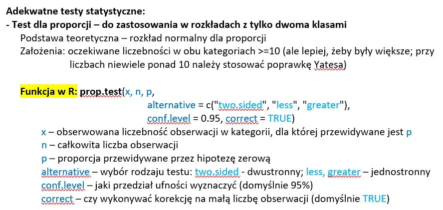
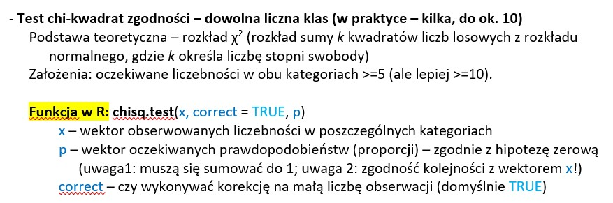
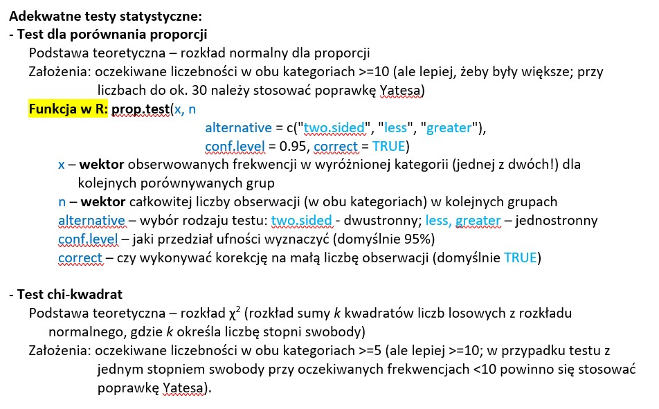
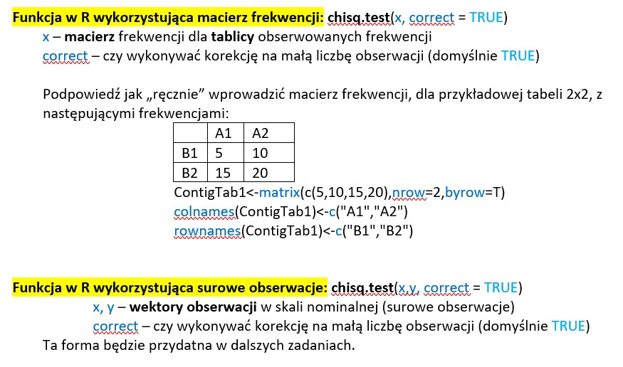
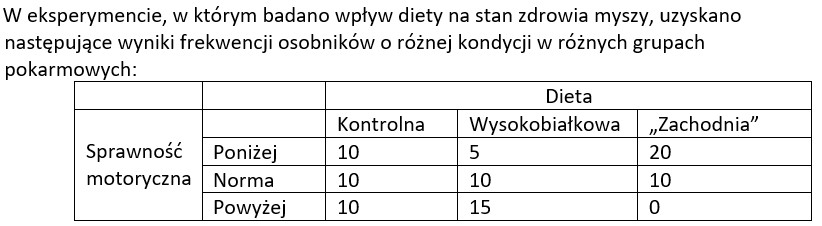
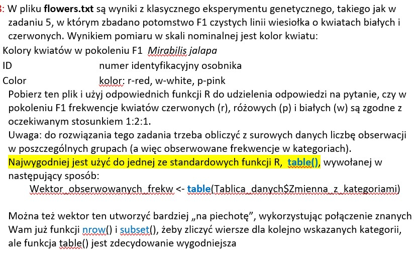
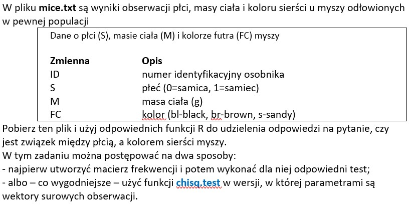

```{r setup, include=FALSE}
knitr::opts_chunk$set(echo = TRUE)
```

```{r,message=FALSE, warning=FALSE}
library("rmdformats")
library("dplyr")
library("ggplot2")
```
# Testowanie zgodności rozkładu liczby obserwacji w kategoriach z rozkładem teoretycznym (ang.: goodness of fit)

Przykładowe pytania na które można odpowiedzieć:

- Czy stosunek płci (stosunek liczby samców do samic) wynosi 1:1?
- Czy prawdopodobieństwo, że losowo wybrany osobnik jest samcem (albo samicą) wynosi 0.5?

**Pytanie 1**: podaj przykład kilku obserwacji w skali nominalnej.\
**Przykłady**: 

* płeć, 
* marka samochodu, 
* kolor oczu 

Pomiar na tej skali pozwala na proste przyporządkowanie do określonej kategorii na zasadzie logicznej (albo dany pomiar należy to danej kategorii, albo nie należy), bez możliwości określenia relacji między wyszczególnionymi kategoriami.

**Pytanie 2**: wyjaśnij, na czym polega statystyczna niezależność obserwacji.\

Statystyczna niezależność obserwacji polega na tym, że żadna z zmierzonych obserwacji nie ma wpływu na wynik kolejnej np. wyrzucenie za pierwszym razem orła nie ma wpływu na kolejny rzut monetą. (Brak korelacji między obserwacjami)

{#id .class width=80% height=80%}\

{#id .class width=80% height=80%}\

**p-value** -prawdopodobieństwo popełnienia błędu pierwszego rodzaju. Jeżeli jest < 0.05 to raportujemy wynik istotny statystycznie. Piszemy że istotne statystycznie są różnicę między zmiennymi i odrzucamy hipotezę zerową. Np. p-value=0.1 to z 10% prawdopodobieństwem jeśli odrzucimy hipotezę zerową to będzie to zła decyzja.

# Zadanie 1: 
W pewnej populacji odłowiono losowo 90 osobników, w tym 70 samców. Czy stosunek płci odbiega od teoretycznego 1:1? 

```{r}
prop.test(x=70,n=90, p=0.5,
alternative = "two.sided",
conf.level = 0.95, correct = FALSE)

```
Wartość p (p-value), w tym przypadku wynosi 1.361e-07. Taka wartość jest poniżej standardowego progu 0,05 co oznacza, że hipoteza zerowa (proporcja sukcesów jest równa 0,5) może być odrzucona na rzecz alternatywnej hipotezy, że proporcja sukcesów jest różna od 0,5.

Na końcu, test wylicza 95% przedział ufności (95 percent confidence interval) dla proporcji sukcesów, który wynosi [0.6815, 0.8513]. Oznacza to, że z 95% prawdopodobieństwem proporcja sukcesów w populacji jest zawarta w tym przedziale.

Dodatkowo, test wylicza estymator proporcji sukcesów (p), czyli oszacowanie proporcji.

"df" oznacza "stopnie swobody" (ang. "degrees of freedom"). Stopnie swobody to liczba niezależnych obserwacji w próbie, które są wolne do zmiany lub ustawienia w sposób umożliwiający obliczenie statystyki testowej.


```{r}
chisq.test(x=c(70,20), correct = TRUE, p=c(0.5, 0.5))
```
Taki sam wynik w rezultacie

# Zadanie 2: 
W innym badaniu udało się odłowić tylko 30 osobników, w tym 20 samców. Czy stosunek płci odbiega od teoretycznego 1:1?

```{r}
  prop.test(x=20,n=30, p=0.5,
          alternative = "two.sided",
          conf.level = 0.95, correct = TRUE)

```
```{r}
chisq.test(x=c(20,10), correct = TRUE, p=c(0.5, 0.5))
```
Z 10% prawdopodobieństwem możemy stwierdzić że odrzucenie hipotezy zerowej będzie złą decyzją z powodu wysokiej wartości p-value. Zgodnie z konwencją wartości p-value<0.05 dla danych istotnych statystycznie, nie mamy argumentów aby odrzucić hipotezę zerową. Stosunek płci nie odbiega od teoretycznego.

# Zadanie 3: 
Na podstawie wyników badań kulturowych, niezależnych od danych demograficznych, postawiono hipotezę, że pewnym lokalnym społeczeństwie praktykuje się selektywną aborcję płodów żeńskich. W regionie do którego ta społeczność należy, przeciętna proporcja chłopców wśród urodzonych dzieci jest zbliżona do średniej światowej i wynosi 0.51. Jednakże, w tej społeczności wśród urodzonych w ostatnim roku 30 dzieci było 20 chłopców. Czy wyniki te potwierdzają tę hipotezę? 


```{r}
prop.test(x=20,n=30, p=0.51,
          alternative = "two.sided",
          conf.level = 0.95, correct = TRUE)

chisq.test(x=c(20,10), correct = TRUE, p=c(0.51, 0.49))

```

Wyniki te nie dostarczają argumentów na rzecz stwierdzenia że w tym lokalnym społeczeństwie praktykuje się selektywną aborcję płodów żeńskich gdyż wartość p-value jest wysoka.


#Zadanie 4: 
W wyniku krzyżówki czystych linii roślin o kwiatach czerwonych i białych, uzyskano 22 rośliny o kwiatach białych, 60 różowych i 28 czerwonych. Czy te wyniki są zgodne z przewidywaniem stosunkiem dla jednogenowej cechy mendlowskiej z kodominacją (1:2:1)?

**mamy 3 kategorie więc nie możemy użyć testu dla proporcji **

```{r}
x <- c(22,60,28)
p <- c(0.25, 0.5, 0.25)
chisq.test(x, correct = TRUE, p)
```
Wartość p-value jest wyższa od 0.05 a zatem wyniki wspierają hipotezę zerową (stosunek 1:2:1), gdyż nie wskazują na jej odrzucenie. 


# Testowanie zależności/niezależności między dwoma pomiarami w skali nominalnej (ang.: tests of association/independence) Analiza tabel wielodzielczych (ang.: contigency table)

Przykładowe pytania na które można odpowiedzieć:

-  czy stosunek płci różni się między dwoma populacjami?
-  czy stosunek płci jest zależny/niezależny od tego, która to populacja?

{#id .class width=80% height=80%}\
{#id .class width=80% height=80%}\


# Zadanie 5
W lesie niedaleko Krakowa stwierdzono, że wśród 90 osobników pewnej ćmy, 70 miało skrzydła jasne, a 20 ciemne. Natomiast w parku w Krakowie, wśród 30 osobników tego samego gatunku 10 miało  jasne a 20 ciemne. Czy te wyniki wspierają roboczą hipotezę, że w warunkach zanieczyszczonego miasta formy **ciemne** występują częściej?

Hipoteza zerowa: "Nie ma zależności między miejscem występowania ćmy, a kolorem jej skrzydeł"

```{r}
ContigTab1<-matrix(c(70,20,10,20),nrow=2,byrow=T)
colnames(ContigTab1)<-c("jasne","ciemne")
rownames(ContigTab1)<-c("las","park" )

x <- c(20, 20)   # pytanie jest o ciemne
n <- c(90, 30)

prop.test(x=c(20, 20), n=c(90, 30),
alternative = "two.sided",
conf.level = 0.95, correct = TRUE)
chisq.test(ContigTab1, correct = TRUE)

```
Wartość p-value jest bardzo mała < 0.05,  a zatem dostarcza argumentów za odrzuceniem hipotezy zerowej na rzecz hipotezy alternatywnej. Wyniki wspierają hipotezę że w warunkach zanieczyszczonego miasta formy ciemne występują częściej.


# Zadanie 6
{#id .class width=80% height=80%}\
Czy frekwencja osobników niskiej, przeciętnej i wysokiej sprawności motorycznej różni się między osobnikami karmionymi dietą normalną, wysokobiałkową i tzw. „dietą zachodnią”?

**mamy 3 kategorie więc nie możemy użyć testu dla proporcji**

```{r}
cin <- matrix(c(10,5,20, 10,10,10 , 10,15,0 ),nrow=3,byrow=T)
colnames(cin)<-c("Kontrolna","Wysokobiałkowa", "Zachodnia")

rownames(cin)<-c("SM-Poniżej","SM-Norma", "SM-Powyżej")

chisq.test(cin,correct = TRUE)

```
p-value jest niskie a zatem świadczy to o różnicach statystycznych, frekwencje osobników różnią się. Należy odrzucić hipotezę zerową.


W przypadku testu chi-kwadrat chisq.test() w R, parametr **correct** określa, czy należy użyć poprawki Yatesa dla kontyngencji o wymiarach 2x2. Poprawka Yatesa to korekta, która została zaproponowana w celu uniknięcia przeszacowania statystyk testowych w przypadku, gdy liczba obserwacji jest niewielka.

W przypadku kontyngencji o wymiarach większych niż 2x2, parametr correct nie ma wpływu na wyniki testu, ponieważ test chi-kwadrat działa na podstawie rozkładu asymptotycznego chi-kwadrat, który nie wymaga korekt dla małych próbek.


# Zadania z surowymi danymi

# Zadanie 7
{#id .class width=80% height=80%}\
```{r}
flowers <-  read.csv("flowers.csv", header = TRUE, sep = "\t")
colors_frekw <-  table(flowers$Color)

chisq.test(colors_frekw, p=c( 0.5, 0.25, 0.25), correct = T)

```
Frekwencje najprawdopodobniej są zgodne z oczekiwanym stosunkiem 1:2:1 gdyż
p-value jest >0.05 więc nie odrzucamy hipotez zerowej.

{#id .class width=80% height=80%}\

```{r}
mice <-  read.csv("mice.csv", header = TRUE, sep = "\t")

ContigTab1 = table(mice$S, mice$FC)  # zgrupowanie dla plci
rownames(ContigTab1)<-c("samice","samce")
colnames(ContigTab1)<-c("bl","br","s")
ContigTab1

chisq.test(ContigTab1, correct = TRUE)


```
Wartość p-value jest większa niż 0.05, a zatem nie dostarcza argumentów za odrzuceniem hipotezy zerowej. Nie wskazuje na występowanie związku między płcią, a kolorem sierści myszy.


