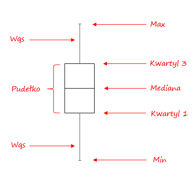
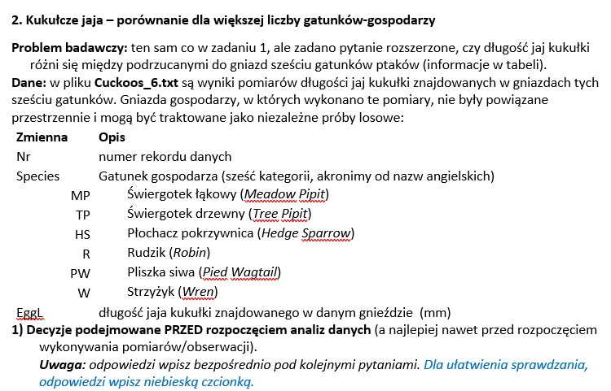
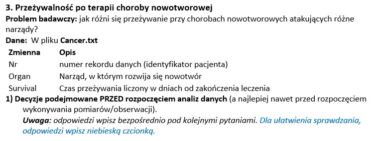

```{r setup, include=FALSE}
knitr::opts_chunk$set(echo = TRUE)
```


- Prosta (=jednoczynnikowa) analiza wariancji (ANOVA)
- Nieparametryczna alternatywa - ANOVA na rangach (test Kruskala-Wallisa)

Potrzebne pakiety:

* tidyverse, ggplot2 (już używane)
* nortest (zawierające testy na normalność rozkładu)
* ggpubr  (ułatwiające tworzenie pewnych wykresów)

Potrzebne funkcje:

Funkcje do tworzenia wykresów:
* hist() – tworzy histogramy (do eksploracyjnej analizy danych sprawdzenia kształtu rozkładu itp.).
* ggplot() –z wykorzystaniem opcji „stat_summary()” i własną funkcją Mean_SE_95CI (wprowadzone w poprzednich zajęciach).

Funkcje do wykonywania analiz i testów statystycznych:

* summary(), summarize() – do przedstawienia statystyk opisowych
* shapiro.test() – do sprawdzania **normalności rozkładu**
* aov() - standardowa funkcja R do wykonania **analizy wariancji**. Wywołanie:
	Model_output <- aov(Y ~ Group, data = My_data)
	gdzie Y to ilościowa zmienna zależna, Group to czynnik kategoryczny (zmienna grupująca). 
	
Wynikowy obiekt przedstawia na wydruku tylko dane podstawowe do analizy wariancje, ale obiekt ten zawiera dane, na podstawie których generowane są pełne wyniki:

* summary(Model_output) – produkuje typową „tabelę ANOVA” z testem istotności;
* TukeyHSD(Model_output) – test post hoc (= a posteriori) dla porównań między wszystkimi parami grup.
* plot(Model_output, Liczba) – tworzy różne wykresy, przy czym Liczba (1-5) wskazuje na rodzaj generowanego wykresu.

Szczególnie użyteczne są trzy wykresy:

* 1 - wykres residuals vs predicted (wartości resztowe vs. wartości przewidywane). Pozwala na „optyczner” sprawdzenie czy wariancja reszt jest podobna dla grup, a także czy rozkład reszt jest symetryczny; 
* 2 - Quantile plot (reszty standaryzowane vs kwantyle teoretyczne dla rozkładu normalnego) – do sprawdzenia czy rozkład jest normalny; jeśli tak, punkty leżą mniej więcej na prostej (logika tego wykresu jest podobna do logiki w teście Shapiro-Wilka);
* 4 - Cook's distance (D): miara wielkości wpływu pojedynczej obserwacji na wyniki; dystans Cooka łączy informacje o wielkości wartości resztowej i tzw. „dźwigni” (leverage), która informuje o tym jak wartość predyktora dla danej obserwacji odbiega od średniej wartości predyktora. Dystans Cooka D jest więc szczególne użyteczny w bardziej zaawansowanych modelach, w których występują też predyktory ilościowe (na dalszych zajęciach), a w przypadku modeli ANOVA dostarczają informacji podobnej jak wartości resztowe, ale w zmodyfikowanej skali. Jeśli wartość D jest większa niż 1, to powinna być traktowana jako „podejrzana”, bo nie tylko odbiega od typowych, ale fakt ten ma znaczny wpływ na konkluzje.


*  hist(Model_output$residuals) – przedstawia histogramy rozkładu reszt.

Wartości resztowe to różnice między wartościami rzeczywistymi a wartościami przewidywanymi przez model statystyczny. Wartości resztowe są ważne, ponieważ pozwalają nam ocenić jakość dopasowania modelu do danych. Idealnie dopasowany model powinien mieć wartości resztowe bliskie zeru, co oznacza, że model jest w stanie wytłumaczyć większość zmienności w danych. Jeśli wartości resztowe są duże, może to sugerować, że model nie jest odpowiedni dla danych i konieczna jest dalsza analiza.

W R wartości resztowe można obliczyć dla modeli statystycznych za pomocą funkcji residuals() na przykład, po oszacowaniu modelu regresji liniowej przy użyciu funkcji lm().

Nieparametryczna alternatywa dla prostej analizy wariancji: test Kruskala-Wallisa, wywoływany podobnie jak aov():

- kruskal.test(Y ~ Group, data = My_data)
Test Kruskala-Wallisa, działa tak samo jak test Wilcoxona, ale może być zastosowany do więcej niż dwóch grup.  Jest równoważny wykonaniu prostej analizy wariancji na danych zamienionych na rangi (czyli przetworzonych do skali porządkowej). Dane „surowe” można zamienić na rangi funkcją rank() i potem wykonać aov() na rangach – wynik będzie taki sam.


```{r}
library(tidyverse)
library(ggplot2)
library(nortest)
library(ggpubr)
library(outliers)
```

# Zadanie 1

{#id .class width=90% height=90%}\

1.3) Sformułuj adekwatną hipotezę alternatywną. 
Średnia długość jaj kukułki w gniazdach świergotka łąkowego i w gniazdach płochacza pokrzywnica różni się.

1.4) Jakiego testu użyjesz „z wyboru” do testowania hipotezy zerowej? 
test t-Studenta dla prób niezależnych lub test wariancji

1.5. Jakie założenia teoretycznie dotyczące rozkładu są wymagane dla wybranego testu?

- rozkład zbliżony do rozkładu normalnego
- próby niezależne
- równe wariancje


2) Analizy statystyczne\
Uwaga: w odpowiedziach umieść zarówno kod R jak i wyniki jego wykonania.

2.1) Przedstaw adekwatne dla tego projektu statystyki opisowe. Na potrzeby tych ćwiczeń przedstaw je w postaci wartości liczbowych jak i w postaci graficznej.


```{r}
Cuckoos_2 <- read.table("Cuckoos_2.txt", header = TRUE, sep = "\t")
Cuckoos_2

#2.1
ggplot(data = Cuckoos_2, mapping = aes(x = Species,
                                       y = EggL)) + geom_boxplot() +
  theme_classic() + theme(text = element_text(size = 14)) +
  labs(x = "Species", y = "Egg length [mean_SE, 95%CI]")

summary(subset(Cuckoos_2, Species=="MP")$EggL)
summary(subset(Cuckoos_2, Species=="HS")$EggL)

Cuckoos_2 %>% group_by(Species) %>%
  summarise(mean=mean(EggL), median=median(EggL),
            maximum=max(EggL), minimum=min(EggL),
            sd=sd(EggL), N=length(EggL))

#2.2
shapiro.test(subset(Cuckoos_2 , Species=="HS")$EggL)
shapiro.test(subset(Cuckoos_2 , Species=="MP")$EggL)
var.test(EggL ~ Species, data = Cuckoos_2)

ggplot(Cuckoos_2, aes(x = EggL)) +
  geom_histogram(binwidth=0.5, colour="black", fill="white") +
  facet_wrap(~Species, scales="fixed") +  #scales = const
  xlab("Egg length (mm)")


```
Wykonano **test normalności Shapiro-Wilka** na dwóch próbach danych, związanych z długością jaj w dwóch gatunkach kukułek. Test ten służy do sprawdzenia, czy próba danych pochodzi z rozkładu normalnego. W przypadku pierwszej próby (Species == "HS"), wartość p wynosi 0,5366, co oznacza, że brak jest wystarczających dowodów na odrzucenie hipotezy o normalności rozkładu. W przypadku drugiej próby (Species == "MP"), wartość p wynosi 0,0002377, co oznacza, że hipoteza o normalności rozkładu zostaje odrzucona na rzecz hipotezy alternatywnej, czyli że rozkład nie jest normalny.


Wykonano również **test F** dla porównania dwóch wariancji prób danych dotyczących długości jaj w dwóch różnych gatunkach kukułek.

Wartość p równa się 0,4055, co oznacza, że brak jest wystarczających dowodów na odrzucenie hipotezy o równości wariancji między tymi dwoma grupami. Oznacza to, że wariancje obu prób są porównywalne, a różnice w długości jaj między tymi dwoma gatunkami kukułek nie są znaczące statystycznie w kontekście wariancji.

Estymowana wartość proporcji wariancji między tymi dwoma grupami wynosi 1,604. Wartości proporcji wariancji większe niż 1 sugerują większą zmienność w jednej z grup. W tym przypadku, wartość proporcji jest nieznacznie większa niż 1, ale brak jest wystarczających dowodów na odrzucenie hipotezy o równości wariancji.

## Próbując otrzymać rozkład normalny decydujemy się na usunięcie wartości odstających.
```{r}
#Sprawdzenie czy sa wartosci odstajace


ggplot(data = Cuckoos_2,
       mapping = aes(x = Species,
                     y = EggL,
                     fill = Species)) +
  geom_boxplot(
    alpha = 0.3,
    outlier.shape = 10,
    outlier.colour = "dark blue",
    outlier.size = 5
  ) + theme_classic() +
  geom_point(
    color = "black",
    position = position_jitterdodge(jitter.width = 0.1),
    size = 3,
    alpha = 0.5,
    stroke = 0
  ) +
  theme(text = element_text(size = 14)) +
  labs(x = "Species", y = "Egg length (median, quartiles, range)")
```


{#id .class width=80% height=80%}\

```{r}
#Usuwanie wartości odstajacych
Cuckoos_2_HS <- Cuckoos_2[Cuckoos_2$EggL > 21 & Cuckoos_2$Species == "HS",]
Cuckoos_2_MP <- Cuckoos_2[Cuckoos_2$EggL > 21 & Cuckoos_2$Species == "MP",]

Cuckoos_2_Filtered <- full_join(Cuckoos_2_HS,Cuckoos_2_MP)

shapiro.test(Cuckoos_2_HS$EggL)
shapiro.test(Cuckoos_2_MP$EggL)

```

Teraz po odrzuceniu wartosci odstajacych otzymujemy rozklady normalne

```{r}
#2.3
t.test(data = Cuckoos_2_Filtered, EggL~Species, paired=FALSE, var.equal=TRUE)

Cuckoo2_ANOVA <- aov(EggL~Species, data = Cuckoos_2_Filtered)
summary(Cuckoo2_ANOVA)
```
Wartość p-value jest mniejsza od 0.05 więc odrzucamy hipotezę zerową i przyjmujemy alternatywną.

W przedstawionym wyniku, t-statystyka wynosi 4.6134, co jest stosunkowo dużą wartością w porównaniu do rozrzutu danych, a p-value wynosi 0.000122, co oznacza, że istnieje bardzo małe prawdopodobieństwo, że różnica między średnimi wynika z przypadku. 95% przedział ufności wskazuje, że średnia długość jaj HS jest większa niż średnia długość jaj MP, co potwierdza wnioski z testu t.

Pr(>F) w wyniku ANOVA oznacza p-value.
Również tu p-value jest mniejsza niż poziom istotności, hipoteza zerowa zostaje odrzucona i można stwierdzić, że istnieje statystycznie istotna różnica między średnimi wartościami długości jaj między dwoma gatunkami kukułek.


```{r}
#2.4
hist(Cuckoo2_ANOVA$residuals)
plot(Cuckoo2_ANOVA,1)
```
Wykres zależności wartości resztowych od wartości przewidywanych ukazuje 2 grupy. Wariancje między tymi grupami nie różnią się znacząco. Rozkład reszt wydaje się być symetryczny, lecz pamiętamy że usunęliśmy parę wartości odstających co wpływa na wynik.
```{r}
plot(Cuckoo2_ANOVA,2)
plot(Cuckoo2_ANOVA,3)
```
Wykres odbiega od rozkładu normalnego lecz jest to bardzo dokładny test.

```{r}
plot(Cuckoo2_ANOVA,4)
```
Wykres pokazuje jaki konkretnie wpływ maja dane wartości na oszacowanie. Idealnie jest gdy każda
wartość ma taki sam wpływ, aczkolwiek u nas nie odbiegają one bardzo.


Uwaga: to zadanie wygląda jak dublowanie punktu 2.2., ale właśnie o to chodzi, żeby pokazać te alternatywne sposoby badania rozkładów. W ANOVA (i modelach liniowych w ogóle) założenia dotyczą naprawdę rozkładu wartości resztowych, a NIE rozkładu bezpośrednio obserwowanych wartości, więc żeby sprawdzić czy założenia ANOVA są spełnione, to trzeba taką analizę najpierw wykonać – a w razie potrzeby wykonać ponownie po odpowiednim zmodyfikowaniu danych. W przypadku bardziej skomplikowanych modeli ANOVA, a zwłaszcza modeli ANCOVA, badanie rozkładu bezpośrednio obserwowanych wartości, takiej jak wykonywane przed testem t Studenta dla porównania dwóch grup, nie może już być zastosowane, bo nie da adekwatnej odpowiedzi.

2.5) Dodaj adekwatne wykresy ilustrujące najważniejsze wyniki, używając zarówno wykresów ogólnego stosowania, jak i wykresów powiązanych wprost z wynikami funkcji aov().


```{r}

#2.5
Mean_SE_95CI <- function(Y) {
  v <- c(mean(Y)-qt(0.975, df = length(Y)-1) * sd(Y) / sqrt(length(Y)),
         mean(Y) - sd(Y)/sqrt(length(Y)),
         mean(Y),
         mean(Y) + sd(Y)/sqrt(length(Y)),
         mean(Y)+qt(0.975, df = length(Y)-1) * sd(Y) / sqrt(length(Y)))
  names(v) <- c("ymin", "lower", "middle", "upper", "ymax")
  v
}

ggplot(data = Cuckoo2_ANOVA, mapping = aes(x = Species,
                                         y = EggL)) +
  stat_summary(fun.data=Mean_SE_95CI, geom="boxplot", width=0.7) +
  theme_classic() + theme(text = element_text(size = 14)) +
  labs(x = "Species", y = "Egg length (mean_SE and 95%CI)[mm]")


```

2.6) Przedstaw i uzasadnij wnioski z wykonanej analizy, odnoszące się do stawianej hipotezy roboczej.

Dokonana analiza z wykorzystaniem testu t-studenta oraz ANOVA pozwala na odrzucenie hipotezy zerowej i przyjęcie alternatywnej. Średnia długość jaj kukułki w gniazdach świergotka łąkowego i w gniazdach płochacza pokrzywnica różni się.


# Zadanie 2

{#id .class width=90% height=90%}\
1.1) Sformułuj adekwatną do problem badawczego i dostępnych danych hipotezę roboczą. Spróbuj przedstawić dwie wersje – jedną odnoszącą się do różnic między średnimi, a drugą do działania „czynnika”.\
Średnia długość jaj kukułki w gniazdach sześciu gatunków ptaków różni się.

1.2) Sformułuj adekwatną hipotezę zerową.\
Średnia długość jaj kukułki w gniazdach sześciu gatunków ptaków jest taka sama.

1.3) Sformułuj adekwatną hipotezę alternatywną.\
Średnia długość jaj kukułki w gniazdach sześciu gatunków ptaków różni się.

1.4) Jakiego testu użyjesz „z wyboru” do testowania hipotezy zerowej? 
Testu ANOVA dla wielu grup\

1.5. Jakie założenia teoretycznie dotyczące rozkładu są wymagane dla wybranego testu?

- rozkład powinien być zbliżony do rozkładu normalnego
- próby niezależne
- równe wariancje 


```{r}
Cuckoos_6 <- read.table("Cuckoos_6.txt", header = TRUE, sep = "\t")
Cuckoos_6

#2.1
ggplot(data = Cuckoos_6, mapping = aes(x = Species,
                                       y = EggL)) +
  geom_boxplot() + theme_classic() +
  theme_classic() + theme(text = element_text(size = 14)) +
  labs(x = "Species", y = "Egg length [mean_SE, 95%CI]")


Cuckoos_6 %>% group_by(Species) %>%
  summarise(mean=mean(EggL), median=median(EggL),
            maximum=max(EggL), minimum=min(EggL),
            sd=sd(EggL), N=length(EggL))

#2.3
ggplot(Cuckoos_6, aes(x = EggL)) +
  geom_histogram(binwidth=0.5, colour="black", fill="white") +
  facet_wrap(~Species, scales="fixed") +  #  dzieli histogram na osobne panele w zależności od wartości zmiennej Species
  xlab("Egg length (mm)")
```

Aby dokonać analizy rozkładu wartości resztowych wykonujemy test ANOVA

```{r}
Cuckoo6_ANOVA <- aov(EggL~Species, data = Cuckoos_6)
summary(Cuckoo6_ANOVA)
```
Wartość p-value jest mniejsza od 0.05 co daje nam argument do odrzucenia hipotezy zerowej i przyjęcia alternatywnej.

```{r}
hist(Cuckoo6_ANOVA$residuals)
```
Rozkład wartości resztowych jest zbliżony do rozkładu normalnego, zatem można przyjąć że również rozkład dla każdej z grup jest zbliżony do normalnego.


```{r}
TukeyHSD(Cuckoo6_ANOVA, header = TRUE, sep = "\t")
```
W wyniku testu Tukeya wykonanego po analizie wariancji zauważamy, że tylko niektóre pary gatunków różnią się znacząco pod względem długości jaj. Konkretnie np. pary MP-HS, PW-W i W-HS różnią się istotnie, podczas gdy pozostałe pary nie różnią się znacząco. Warto zauważyć, że wynik ten jest spójny z wcześniejszą analizą ANOVA, która wykazała istotny efekt dla czynnika gatunku, ale nie dała nam informacji, które pary są od siebie istotnie różne.

```{r}
plot(TukeyHSD(Cuckoo6_ANOVA), las=1, col="red")
```
Różnice istotne statystycznie występują pomiędzy grupami które odstają od wartości środkowej.

```{r}
#2.4
ggplot(data = Cuckoo6_ANOVA, mapping = aes(x = Species,
                                         y = EggL)) +
  stat_summary(fun.data=Mean_SE_95CI, geom="boxplot", width=0.7) +
  theme_classic() + theme(text = element_text(size = 14)) +
  labs(x = "Species", y = "Egg length (mean_SE and 95%CI)[mm]")

plot(Cuckoo6_ANOVA, 1)
```
Patrząc na wykres możemy stwierdzić że wariancje między grupami są podobne.
```{r}
plot(Cuckoo6_ANOVA, 2)
```
Widzimy że rozkład wartości resztowych jest zbliżony do rozkładu normalnego.

```{r}
plot(Cuckoo6_ANOVA, 3)

#Miara wielkości wpływu pojedynczej obserwacji na wyniki:
plot(Cuckoo6_ANOVA, 4)


#2.5
kruskal.test(EggL~Species, data=Cuckoos_6)

```
Stopnie swobody (df) wynoszą 5, co odpowiada liczbie gatunków minus 1. Wartość p wynosi 1,37e-06, czyli mniej niż 0,05, co wskazuje na mocne dowody przeciwko hipotezie zerowej, że wszystkie gatunki mają tę samą średnią długość jaj. Dlatego możemy stwierdzić, że istnieją znaczne różnice w długości jaj między co najmniej dwoma z sześciu gatunków.


Po wykonanej analizie z użyciem testu ANOVA i Kruskala-Wallisa otrzymujemy argumentu za odrzuceniem hipotezy zerowej i przyjęciem alternatywnej. Średnia długość jaj kukułki w gniazdach świergotka łąkowego i w gniazdach płochacza pokrzywnica różni się.

# Zadanie 3
{#id .class width=90% height=90%}\
1.1) Sformułuj adekwatną do problem badawczego i dostępnych danych hipotezę roboczą. Spróbuj przedstawić dwie wersje – jedną odnoszącą się do różnic między średnimi, a drugą do działania „czynnika”.\

Przeżywalność przy chorobach nowotworowych atakujących różne narządy różni się.

1.2) Sformułuj adekwatną hipotezę zerową.
Przeżywalność przy chorobach nowotworowych atakujących różne narządy jest taka sama.

1.3) Sformułuj adekwatną hipotezę alternatywną. 
Przeżywalność przy chorobach nowotworowych atakujących różne narządy różni się.

1.4) Jakiego testu użyjesz „z wyboru” do testowania hipotezy zerowej?\
Testu ANOVA

1.5. Jakie założenia teoretycznie dotyczące rozkładu są wymagane dla wybranego testu?\

- rozkład zbliżony do rozkładu normalnego
- próby niezależne
- równe wariancje


```{r}
Cancer <- read.table("Cancer.txt", header = TRUE, sep = "\t")
Cancer

#2.1
ggplot(data = Cancer, mapping = aes(x = Organ,
                                       y = Survival)) +
  geom_boxplot() + theme_classic() +
  theme_classic() + theme(text = element_text(size = 14)) +
  labs(x = "Organ", y = "Survival [days after treatment]")


Cancer %>% group_by(Organ) %>%
  summarise(mean=mean(Survival), median=median(Survival),
            maximum=max(Survival), minimum=min(Survival),
            sd=sd(Survival), N=length(Survival))

#2.2
ggplot(Cancer, aes(x = Survival)) +
  geom_histogram(bins=10, colour="black", fill="white") +
  facet_wrap(~Organ, scales="fixed") +
  xlab("Survival [days after treatment]")

```
Wykresy odbiegają od rozkładu normalnego.

```{r}
Cancer_ANOVA <- aov(Survival~Organ, data = Cancer)
summary(Cancer_ANOVA)

hist(Cancer_ANOVA$residuals)

plot(Cancer_ANOVA, 1)
```
Wariancje różnią się pomiędzy grupami.

```{r}
plot(Cancer_ANOVA, 2)
```
Rozkład znacząco odbiega od rozkładu normalnego.
```{r}
plot(Cancer_ANOVA, 3)
plot(Cancer_ANOVA, 4)
```
Wartości odstające nie mają wielkiego wpływu na wyniki, gdyż są mniejsze od 1.

Aby uzyskać poprawne założenia do testu ANOVA wykonujemy transformacje logarytmiczną oraz ponawiamy wcześniejsze analizy.
```{r}

#2.4
Cancer_log <- Cancer
Cancer_log$Survival <- log(Cancer_log$Survival, 10)
Cancer_log_ANOVA <- aov(Survival~Organ, data=Cancer_log)
summary(Cancer_log_ANOVA)
```
Wartość p-value jest mniejsza od 0.05 zatem odrzucamy hipotezę zerową.
```{r}
hist(Cancer_log_ANOVA$residuals)

plot(Cancer_log_ANOVA, 1)
```
Po transformacji wariancje są już zbliżone.
```{r}
plot(Cancer_log_ANOVA, 2)
```
Rozkład wartości resztowych również zbliżył się do normalnego.
```{r}
plot(Cancer_log_ANOVA, 4)


Tukey <- TukeyHSD(Cancer_log_ANOVA, header = TRUE, sep = "\t")

data.frame(Tukey$Organ[Tukey$Organ[,4]<0.05,4])

```
Największe różnice w przeżywalności występują między:

- Bronchus-Breast                           
- Stomach-Breast\

Gdyż wartość p-value dla nich jest mniejsza od 0.05.                     

```{r}

ggplot(Cancer_log, aes(x = Survival)) +
  geom_histogram(bins=10, colour="black", fill="white") +
  facet_wrap(~Organ, scales="fixed") +
  xlab("Survival [days after treatment]")


#2.4
ggplot(data = Cancer_ANOVA, mapping = aes(x = Organ,
                                        y = Survival)) +
  stat_summary(fun.data=Mean_SE_95CI, geom="boxplot", width=0.7) +
  theme_classic() + theme(text = element_text(size = 14)) +
  labs(x = "Organ", y = "Survival [days after treatment]")


#2.5
kruskal.test(Survival~Organ, data=Cancer_log)
```
Wartość p-value jest mniejsza od 0.05 zatem odrzucamy hipotezę zerową i przyjmujemy alternatywną.

Po wykonanej analizie z użyciem testów ANOVA i Kruskala-Wallisa uzyskujemy argument za odrzuceniem hipotezy zerowej i przyjęciem alternatywnej. Przeżywalność przy chorobach nowotworowych atakujących różne narządy różni się.

